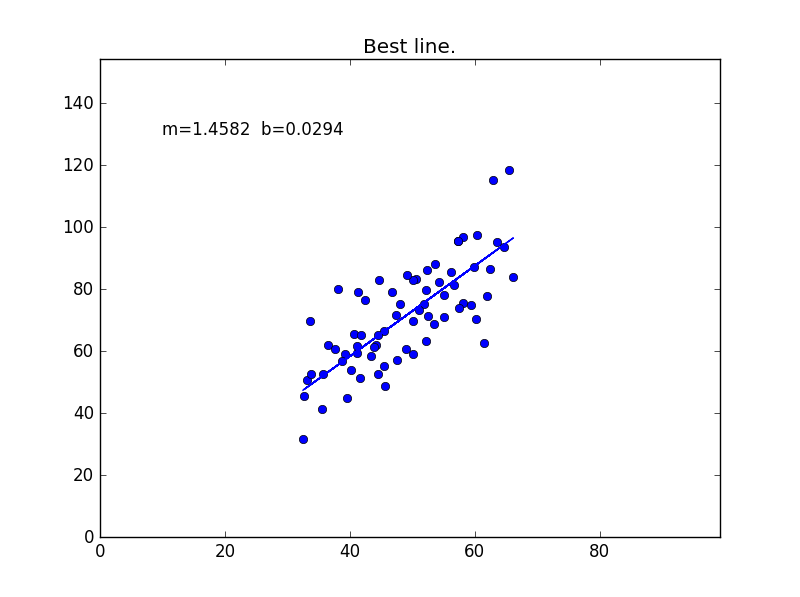
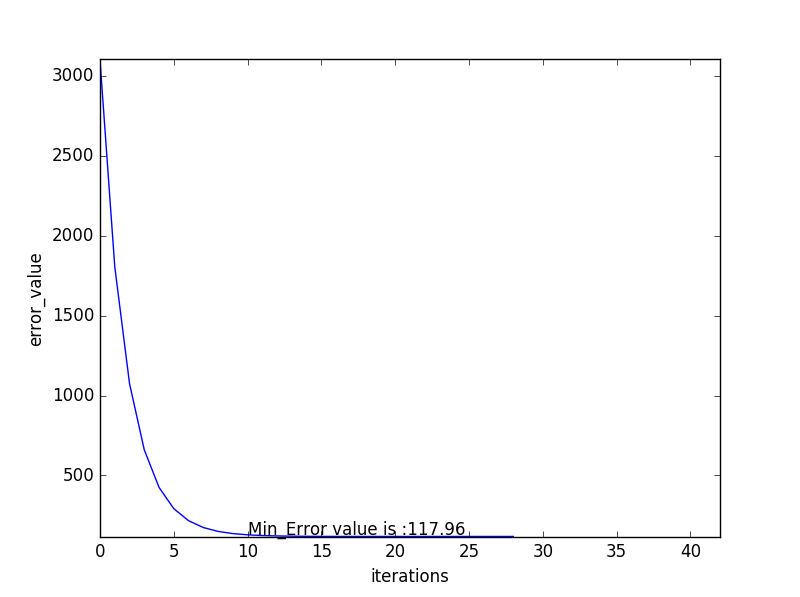
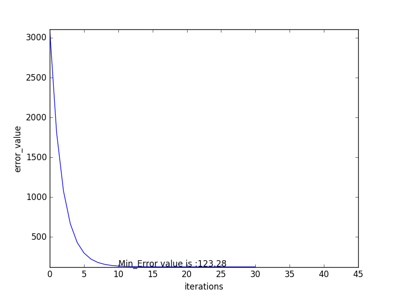

# Regularisation - L1 and L2
### Implementation of the Gradient Descent Optimizer with L1 and L2 regularisation for Liner Regression problem.

The code above is for the challenge of [this](https://www.youtube.com/watch?v=s0Q3CojqRfM) video by [Siraj Raval](https://github.com/llSourcell) on YouTube.

### Dependencies

* Pandas
* Matplotlib
* numpy

### Dataset

The dataset has 2 columns, distance cycled and calories burnt. I have used calories burnt as the output(Y) with distance cycled as input(X). Thus aiming to find a linear function f(X) = Y.

## Script 1: data_parser.py

This script is used as a helper script, to read in the csv file. Once it is read in, the missing values are replaced with a 0. The desired columns alone are chosen and are returned as a python array. For the purpose of demo, only the first 1000 rows are returned.

## Script 2: regularisation.py

I have implemented a vanilla gradient descent method in step_gradient function. You can see the script for in-depth comments for each line of code.

I have also added 2 different modifications to the vanilla gradient descent optimizer. I have added an early stopping feature, which can be controlled by *early_stop_number* parameter and also I have added adaptive learning rate, through which the learning rate increases by .00002 everytime the error value decreases consecutively for more than 3 times. This aims to increase the computational speed. This feature can be controlled via the *modify_lr* flag.

## Script 2: regularisation.py functions *compute_total_error* and *step_gradient*

### The actual action happens here.

I have implemented a regularised error function in the compute_total_error function. The only variables are m and b; b is a contant and so is not included in regularisation, so error is calculated as Mean Square Error + noise. The noise is the product of *(tuning_rate/2) x absolute_value(m)* in the case of l1 regularisation, in case of l2 regularisation the noise is calculated as *(tuning_rate/2) x (m^2)*, this noise is then added to the *mean_squared_error*.

In the step_gradient function, the variables m and b are adjusted using the gradient descent algorithm. Here, the error function calculated as *f(x) = (y - (mx + b)) ^ 2 + (tuning_rate/2) * absolute(m)*, for l1 regularisation and as *f(x) = (y - (mx + b)) ^ 2 + (tuning_rate/2) * m^2*, for l2 regularisation. In the case of l1 regularisation, *df(x)/dm = -2 * (y - (mx + b)) * x + tuning_rate/2* and is calculated *df(x)/dm = -2 * (y - (mx + b)) * x + tuning_rate * m* in the case of l2 regularisation.

These weights are adjusted based on the new derivatives. This prevents overfitting of the model on training data.  

## Result Visualization

After performing a Linear Regression with a Gradient Descent as optimizer the following is the visualization of the function:

**Y = M * X + C**

After performing a Linear Regression with l1 regularisation the following is the visualization of the function:

**Y = M * X + C**

After performing a Linear Regression with l2 regularisation the following is the visualization of the function:

**Y = M * X + C**

It can be seen from the following charts that for l1 and l2 regularisation, the min error value is greater than the linear regression model without any regularisation. This shows that regularisation prevents overfitting of training data.

**Error without regularisation**

**Error with L1 regularisation**

**Error with L2 regularisation**

#### Thanks Siraj, I absolutely love your videos.
