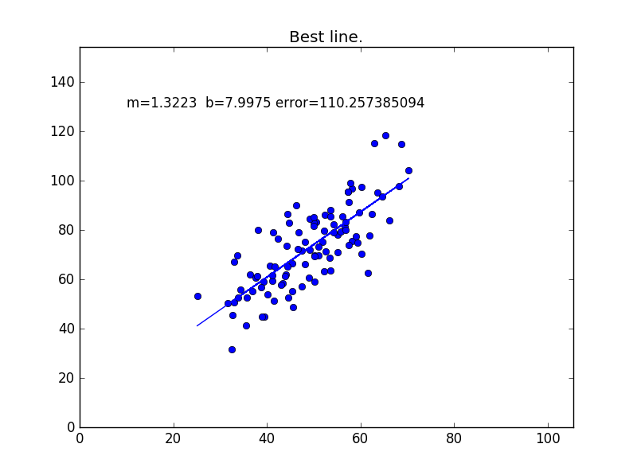

# Gradient Descent
### Implementation of the Gradient Descent Optimizer with Early Stopping and dynamic Learning Rate for Liner Regression problem.

The code above is for the challenge of [this](https://www.youtube.com/watch?v=UIFMLK2nj_w&t=1s) video by [Siraj Raval](https://github.com/llSourcell) on YouTube.

### Dependencies

* Pandas
* Matplotlib
* numpy

### Dataset

The dataset has 2 columns, distance cycled and calories burnt. I have used calories burnt as the output(Y) with distance cycled as input(X). Thus aiming to find a linear function f(X) = Y.

## Script 1: data_parser.py

This script is used as a helper script, to read in the csv file. Once it is read in, the missing values are replaced with a 0. The desired columns alone are chosen and are returned as a python array. For the purpose of demo, only the first 1000 rows are returned.

## Script 2: gradient_descent.py

I have implemented a vanilla gradient descent method in step_gradient function. You can see the script for in-depth comments for each line of code.

I have also added 2 different modifications to the vanilla gradient descent optimizer. I have added an early stopping feature, which can be controlled by *early_stop_number* parameter and also I have added adaptive learning rate, through which the learning rate increases by .00002 everytime the error value decreases consecutively for more than 3 times. This aims to increase the computational speed. This feature can be controlled via the *modify_lr* flag.

## Script 3: second_order_optimization.py

### The actual action happens here.

I have implemented a 2nd order optimization method in compute_newton function, it finds the minimal error point_pair *(m,b in y = mx+ b)* for a simple linear regression problem. You can see the script for in-depth comments for each line of code.

I have also compared the gradient_descent and second_order_optimization methods and it is seen that though there is very less time difference between the two, owing to the small size of the dataset, however, second_order_optimization has a lesser *mean squared error* than gradient_descent, converging at a point much closer to the optimal minima. I have also added early stopping when there is no improvement in the total_error.

## Result Visualization

After performing a Linear Regression with a Gradient Descent as optimizer the following is the visualization of the function:

**Y = M * X + C**

After performing a Linear Regression with The Newton Method as 2nd order optimizer the following is the visualization of the function:

**Y = M * X + C**

#### Thanks Siraj, I absolutely love your videos.
